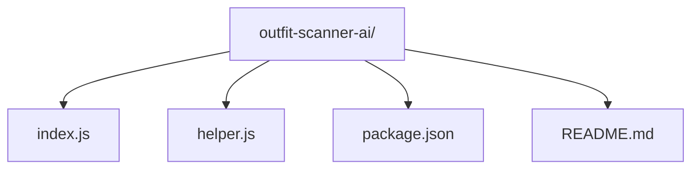

# outfit-scanner-ai

AI-powered outfit analysis and shopping scanner API

[](https://nodejs.org/)
[](https://www.npmjs.com/)

## 📚 Table of Contents

- [Description](#description)
- [Tech Stack](#tech-stack)
- [Architecture Overview](#architecture-overview)
- [File Structure](#file-structure)
- [Features](#features)
- [Installation](#installation)
  - [Prerequisites](#prerequisites)
  - [Setup](#setup)
- [Usage](#usage)
  - [Execution Options](#execution-options)
  - [API Endpoint Testing](#api-endpoint-testing)
- [Scripts](#scripts)
- [Contributing](#contributing)
- [Contributors](#contributors)
- [License](#license)
- [Credits](#credits)

---

## Description

The `outfit-scanner-ai` is a backend API designed to intelligently analyze uploaded outfit images and provide relevant shopping information. Leveraging AI capabilities through the OpenAI API, it processes images to understand outfit components and then uses web scraping techniques (via Puppeteer and Cheerio) to search for similar items on Google Shopping. This project serves as a bridge between visual outfit analysis and e-commerce product discovery, offering a robust solution for fashion-tech applications.

---

## Tech Stack

[](https://nodejs.org/)
[](https://expressjs.com/)
[](https://openai.com/)
[](https://axios-http.com/)
[](https://www.npmjs.com/package/multer)
[](https://pptr.dev/)
[](https://sharp.pixelplumbing.com/)
[](https://github.com/motdotla/dotenv)
[](https://cheerio.js.org/)
[](https://github.com/PIYUSH1SAINI/ReadMe-wiz.git)

---

## Architecture Overview

```mermaid
graph TD
    A[Client Request] --> B{Express App};
    B --> C[Multer: Image Upload];
    C --> D[Sharp: Image Processing];
    D --> E[analyzeOutfit(imagePath)];
    E --> F[OpenAI API: Outfit Analysis];
    F --> G[searchGoogleShopping(query, item)];
    G --> H[Puppeteer/Cheerio/Axios: Google Search];
    H --> I[Google Shopping Results];
    I --> J[Response to Client];
```

---

## File Structure



---

## Features

- **AI-Powered Outfit Analysis**: Integrates with OpenAI to analyze uploaded images and identify key outfit components and styles.
- **Image Upload & Processing**: Handles image uploads via Multer and performs efficient image manipulation using Sharp for optimal analysis.
- **Google Shopping Integration**: Scrapes Google Shopping results using Puppeteer and Cheerio to find similar items based on AI analysis.
- **Robust RESTful API**: Provides well-defined API endpoints using Express.js for seamless integration with client applications.
- **Dynamic Search Queries**: Generates targeted Google Shopping queries based on the AI's understanding of the outfit.
- **Environment Variable Management**: Securely manages API keys and other sensitive configurations using `dotenv`.

---

## Installation

### Prerequisites

> [!NOTE]
> Node.js version 14 or higher is required for compatibility with the project's dependencies.

Ensure you have Node.js and npm (Node Package Manager) installed on your system. You can download them from the [official Node.js website](https://nodejs.org/).

### Setup

> [!TIP]
> Use `git clone https://github.com/Sainirmit/outfit-scanner-ai.git`, `cd outfit-scanner-ai`, and `npm install` for quick setup.

1.  **Clone Repository**: Clone the repository from GitHub and set up the project locally for development or modification.

    ```bash
    git clone https://github.com/Sainirmit/outfit-scanner-ai.git
    cd outfit-scanner-ai
    npm install
    ```

---

## Usage

### Execution Options

> [!IMPORTANT]
> Ensure you have an `.env` file in the project root with your `OPENAI_API_KEY` and any other necessary environment variables before running the application.

To start the `outfit-scanner-ai` backend server, use the `start` script defined in `package.json`. This will initiate the Express application and make the API endpoints available.

#### Backend Execution

```bash
npm run start
```

This command will use `nodemon` to run `index.js`, automatically restarting the server on file changes, which is convenient for development.

### API Endpoint Testing

Once the backend server is running (after executing `npm run start`), you can test the `/scan` endpoint using `curl`.

```bash
curl -X POST http://localhost:3000/scan
```

> [!WARNING]
> The above `curl` command sends a POST request to the `/scan` endpoint without an actual image payload. The `outfit-scanner-ai` API is designed to process _uploaded outfit images_. This command might result in an error or an incomplete process if the API expects an image file as `multipart/form-data`. For a complete test, you would typically use a tool like Postman, Insomnia, or a frontend application to send a `multipart/form-data` request with an image file.

---

## Scripts

The project includes the following npm script:

```bash
"start": "nodemon index.js"
```

- **`npm run start`**: Runs the `index.js` file using `nodemon`. This script is designed for development, providing automatic server restarts upon code changes, which streamlines the development workflow.

---

## Contributing

We welcome contributions to `outfit-scanner-ai`! If you have suggestions for improvements, new features, or bug fixes, please feel free to:

1.  Fork the repository.
2.  Create a new branch for your feature or bug fix.
3.  Commit your changes following conventional commit guidelines.
4.  Push your branch and submit a pull request.

---

## Contributors

<a href="https://github.com/Sainirmit" target="_blank"></a>

---

## License

This project is licensed under the ISC License. For more details, see the `LICENSE` file in the repository.

---

## Credits

This project was developed by PIYUSH1SAINI.

Special thanks to the creators and maintainers of the following technologies and libraries that made this project possible:

- Node.js
- Express.js
- OpenAI
- Axios
- Cheerio
- Dotenv
- Multer
- Node-Fetch
- Nodemon
- Puppeteer
- Puppeteer-Extra
- Puppeteer-Extra-Plugin-Stealth
- Sharp

<a href="https://github.com/PIYUSH1SAINI/ReadMe-wiz.git" target="_blank">
      
    </a>
```
